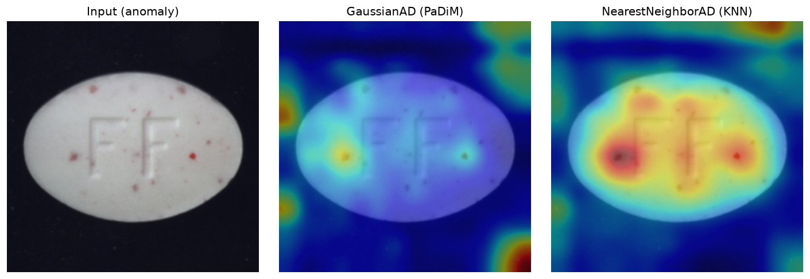
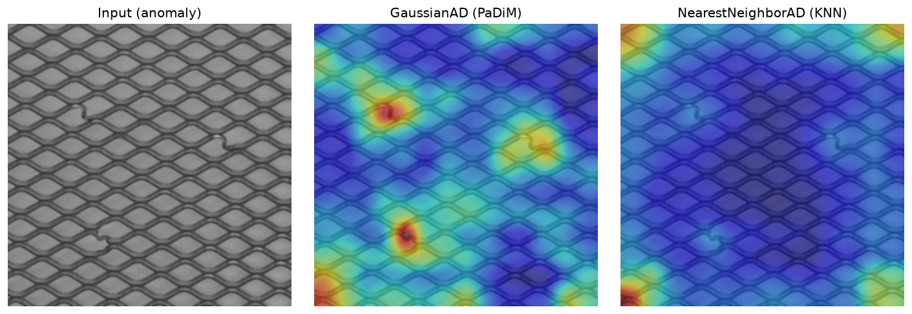
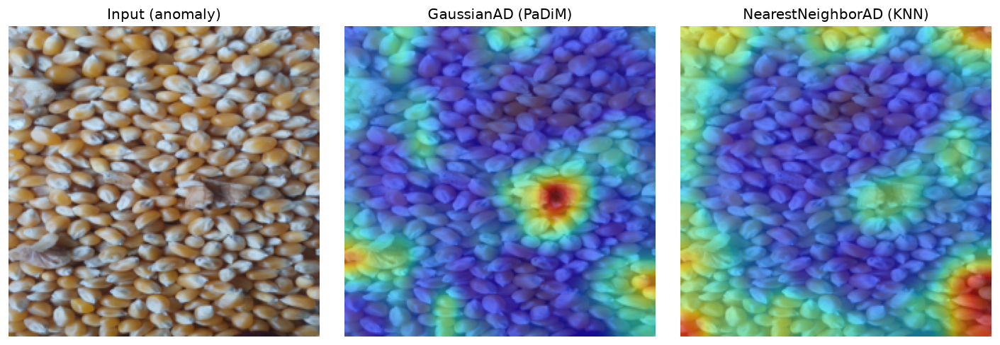

# Industrial anomaly detection with pretrained ResNet features

Two methods for locating defects on manufactured parts, applied to the MVTec AD benchmark and extended to a self-recorded video of a raw-material stream. Feature-space anomaly detection using a frozen ResNet-18 backbone, no fine-tuning, no labels beyond `good` samples at training time.



*Pill with a `color` defect. KNN localizes the specks correctly. PaDiM fires on the object boundary and misses them.*



*Grid with broken wires. PaDiM cleanly points at each defect. KNN barely reacts.*

## The interesting result

The two methods disagree, and which one wins flips between categories.

Grid is a repetitive texture with almost no variation between training images. PaDiM's per-pixel Gaussians end up tight, so any deviation stands out. KNN's memory bank always finds *some* neighbor that looks vaguely like the defective patch, so the distance stays small and the defect gets missed.

Pill has natural pose and lighting variation between training samples. That spreads the per-location feature distribution, PaDiM's Gaussian at each pixel becomes diffuse, and the highest-variance region ends up being the object edge, i.e. exactly where you don't want the model to react. KNN is position-agnostic: a colored speck is compared to training features from any location, finds no close match, and lights up in the right place.

The one-line rule: PaDiM assumes normal is a single Gaussian blob at each pixel. KNN only assumes normal features live close to something already seen. When the data matches the assumption, that method wins.

## Video extension: raw-material stream

To stress-test the same pipeline on data I recorded myself, I filmed a 40-second phone video of popping corn spread on the floor, with a grape and walnut chunks introduced as foreign objects. The camera slides at roughly constant height over the corn strip. Training uses 32 clean frames from the first 17 seconds; test frames come from later in the video.


*GaussianAD applied per-frame. Cool blue overlay on clean corn, red hotspot on the grape, weaker but visible hotspot on the walnut chunks. Red banner fires when the max score exceeds a threshold calibrated on clean held-out frames.*



*Same frame with three walnut chunks. PaDiM localizes all three. KNN misses them and fires on frame corners instead.*

The MVTec disagreement pattern carries over. The camera slides so frames are not registered globally, but at any given cell of the 14x14 feature grid, all 32 training frames show corn. A foreign object at that cell is far from the per-cell Gaussian, and PaDiM detects it. KNN pools all training vectors into one bank where a walnut can hide among the diverse corn features it has seen at other positions. Grape is easy for both methods because color plus texture is so out-of-distribution that any distance detects it. Walnut is texture-only and needs the position-locked Gaussian to win.

The video pipeline is in `src/video.py`. Threshold is calibrated on 6 clean held-out frames as `max(clean_scores) * 1.10`. Banner fires when at least 7 of the last 10 frames exceed threshold (relaxed persistence rule, tolerates one-off dips). Overlay uses a fixed color scale so cool colors mean below threshold and warm colors mean above, consistent across frames.

## Methods

Both share the pipeline:

1. Extract features from `layer3` of a pretrained ResNet-18 (256 channels, 14x14 grid at 224x224 input).
2. Fit a model of "normal" using training features from the `good` class only.
3. Score test features per spatial location.
4. Upsample to image resolution and smooth with a Gaussian filter.

`GaussianAD` fits `N(mu, Sigma)` per pixel over training features, scores test images by Mahalanobis distance. Diagonal covariance by default. Follows the shape of Defard et al., PaDiM (ICPR 2020).

`NearestNeighborAD` pools all training feature vectors into a memory bank capped at 20,000 random samples, scores test features by mean L2 distance to the top-3 nearest neighbors. Simplified variant of Roth et al., PatchCore (CVPR 2022), skipping the coreset subsampling.

## Repository layout


```
src/
dataset.py       MVTec loader, PIL -> tensor, train/test splits
features.py      Frozen ResNet-18 truncated at a configurable layer
methods.py       GaussianAD and NearestNeighborAD, shared interface
visualize.py     Heatmap upsampling, smoothing, side-by-side plotting
video.py         Full-video annotation pipeline, CLI and importable
notebooks/
01_exploration.ipynb       Look at the data
02_padim_baseline.ipynb    Fit and evaluate GaussianAD on MVTec grid
03_knn_method.ipynb        Fit and evaluate NearestNeighborAD on MVTec pill
04_corn_custom.ipynb       Fit both on the custom corn category, calibrate threshold
results/
heatmaps/                  Comparison figures used in this README
gifs/                      Demo gif embedded above
conveyor_corn_annotated_h264.mp4   Full annotated video (H.264, browser-playable)
```
## Running it

You need the MVTec AD dataset from https://www.mvtec.com/company/research/datasets/mvtec-ad. The MVTec figures use the `pill` and `grid` categories. The corn video is not bundled; the pipeline works on any similarly-structured input.

```bash
git clone git@github.com:arachih/industrial-anomaly-detection.git
cd industrial-anomaly-detection

uv venv .venv --python 3.12
source .venv/bin/activate
uv pip install torch torchvision --index-url https://download.pytorch.org/whl/cu124
uv pip install -r requirements.txt

ln -s /path/to/mvtec data/mvtec
jupyter lab notebooks/
```

For the video pipeline, after fitting a model in `04_corn_custom.ipynb` (saves `results/corn_model.pt`):

```bash
python -m src.video \
  --input data/conveyor_corn.mp4 \
  --output results/conveyor_corn_annotated.mp4 \
  --model results/corn_model.pt

ffmpeg -y -i results/conveyor_corn_annotated.mp4 \
  -c:v libx264 -pix_fmt yuv420p -movflags +faststart \
  results/conveyor_corn_annotated_h264.mp4
```

The second command transcodes to H.264 for browser playback (OpenCV's default `mp4v` codec is not universally supported).

On an RTX 1000 Ada 6 GB, fitting either method on one category takes about 30 seconds, scoring a static test image is under 100 ms, and full-video annotation runs at roughly 20 to 30 fps.

## Design choices

*Why layer3.* Layer 4 gives more semantic features but drops spatial resolution to 7x7, too coarse to localize small defects like the color specks on the pill (a few pixels each). Layer 2 keeps resolution but the features are too low-level, mostly edges.

*Why diagonal covariance.* Full 256x256 covariance per pixel means 12M parameters per category and matrix inversion at inference, for maybe a percentage point of accuracy on MVTec AD.

*Why cap the KNN bank at 20,000.* The natural bank size (267 pill training images x 14 x 14 ~ 52k vectors) is manageable but slow. PatchCore uses a proper coreset algorithm; random subsampling is coarser but enough to demonstrate the method.

*Why calibrate threshold on clean frames only.* Setting the threshold from anomaly examples would tie the detector to grape and walnut. Using clean frames only means the same threshold generalizes to rice, almond, or any other foreign object without recalibration.

*Why fixed color scale in the video overlay.* Per-frame normalization (min-max on the current heatmap) makes noise on clean frames look like signal. Fixed scale with `vmax = 2 * threshold` maps cool colors below threshold and warm colors above, consistent across the whole video.

*No AUROC numbers.* MVTec test sets have around 100 images per category. AUROC on that few samples is noisy, and this repo is about localization quality (visible heatmaps), not classification. A proper 15-category sweep is on the roadmap.

## Limitations

Not SOTA. Reference PatchCore uses ResNet-50 with WideResNet weights, proper coreset subsampling, and multi-scale features. This repo gives the intuition with a fraction of the code.

Only two MVTec categories in the figures. A full 15-category sweep is deferred.

Assumes clean training data. Contamination of the `good` set with subtle defects degrades both methods.

The corn video was recorded at home, not on an actual industrial conveyor. Single lighting condition, 30fps consumer phone camera, 40 seconds total. The 32-frame training set is thin for a per-pixel covariance estimate; the walnut signal sits closer to threshold than the grape and would benefit from more data.

## Roadmap

- Full 15-category MVTec sweep with per-category AUROC.
- Multi-scale features (concatenate `layer2` and `layer3`).
- Real coreset subsampling in `NearestNeighborAD`.
- Ensemble scoring: `max(gad_normalized, knn_normalized)` to combine per-cell and position-agnostic strengths.
- More training data for the corn category to tighten the covariance estimate on the walnut case.
- CFD extension: applying the same normal-manifold framework to simulation snapshots for detecting solver instabilities or extreme events.

## References

- Bergmann et al., MVTec AD, CVPR 2019.
- Defard et al., PaDiM, ICPR 2020.
- Roth et al., PatchCore, CVPR 2022.